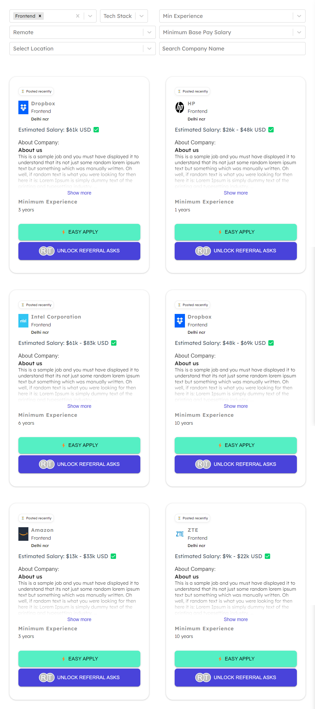
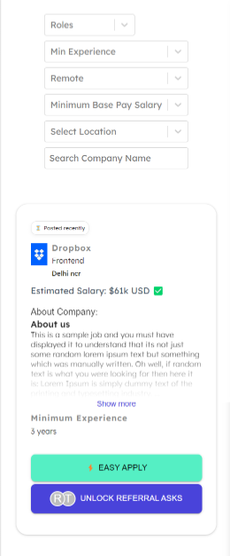

# Candidate Application Platform

This is a React-based job board application that allows users to search and filter job listings based on various criteria such as job roles, locations, experience levels, and salary ranges. The application fetches job data from a provided API and displays the results in a grid format with infinite scrolling functionality.

**Desktop View**

> ## 🚀 [Deployed Link](https://candidate-application-platform-v1.vercel.app/) - Click here for live preview

## Features

- Search for jobs by company name
- Filter jobs by roles, locations, experience levels, salary - ranges, and location types (remote, in-office, hybrid)
- Infinite scrolling to load more job listings as the user scrolls down
- Responsive design for various screen sizes

## Technologies Used

- React
- React Redux (Redux Toolkit)
- react-select
- Material-UI
- CSS

## Getting Started

### To run the application locally, follow these steps:

### 1. Clone the repository:

> git clone https://github.com/Bhikule19/candidate-application-platform-v1

### 2. Install dependencies:

> cd job-board

> npm install

### 3. Start the development server:

> npm start

## Dependencies

The following dependencies are required to run the application:

- React
- React Redux
- @reduxjs/toolkit (^1.9.3)
- react-select
- @mui/material (^5.11.12)

You can install these dependencies by running the following command:

> npm install react react-dom react-scripts @reduxjs/toolkit react-redux react-select @mui/material @emotion/react @emotion/styled

## Functions and Components

The application is built using React and follows a component-based architecture. The main functionality is divided into separate components, each responsible for a specific task.

### 1. **JobBoard** Component:

- This is the main component that serves as the container for the entire job board.
- It manages the application state using React Redux and the _jobSlice_ reducer.
- It handles user input from various filters (roles, locations, experience, salary, location type) and updates the corresponding state using Redux actions.
- It filters the job data based on the selected filters and search input.
- It renders the filtered job data using the _JobCard_ component.
- It implements infinite scrolling functionality using the _useInfiniteScrollAndFetch_ custom hook to fetch and update job data as the user scrolls.

### 2. **JobCard** Component:

- This component is responsible for rendering individual job listing cards.
- It displays the job details such as company name, job role, location, estimated salary range, job description, minimum experience required, and application/referral buttons.
- It implements functionality to expand/collapse the job description text and apply styling accordingly.

### 3. **RolesInput, LocationInput, ExpInput, MinSalaryInput, LocationTypeInput, TechInput** Component:

- These components provide dropdown menus for users to select various filters (roles, locations, experience levels,Tech stack, salary ranges, location types).
- They use the react-select library to render the dropdown menus.
- They handle user selections and update the corresponding state in the JobBoard component using Redux actions.

### 4. **JobCardSkeleton** Component:

- This component is responsible for rendering a shimmer effect (loading skeleton) while job data is being fetched.

### 5. **useInfiniteScrollAndFetch** Custom Hook:

- This custom hook implements the infinite scrolling functionality.
- It fetches job data from the provided API and manages the loading and error states.
- It returns the fetched job data, loading state, and error state to be used in the _JobBoard_ component.

### 6. **Redux Store and Reducers:**

- The application state is managed using Redux and the Redux Toolkit library.
- The _jobSlice_ reducer handles state updates related to job filters, search input, and selected options.
- The Redux store is configured in the _store.js_ file.

The application follows a modular approach, where each component is responsible for a specific functionality. The components communicate with each other through props and Redux state management. The custom hook useInfiniteScrollAndFetch is used to implement the infinite scrolling functionality and fetch job data as needed.

### 7. Responsive Design

The application is designed to be responsive and provide an optimal viewing experience across different devices and screen sizes. This is achieved through the use of CSS media queries and responsive design techniques.

> Tablet View:
> 

> Mobile View:
>
> 
